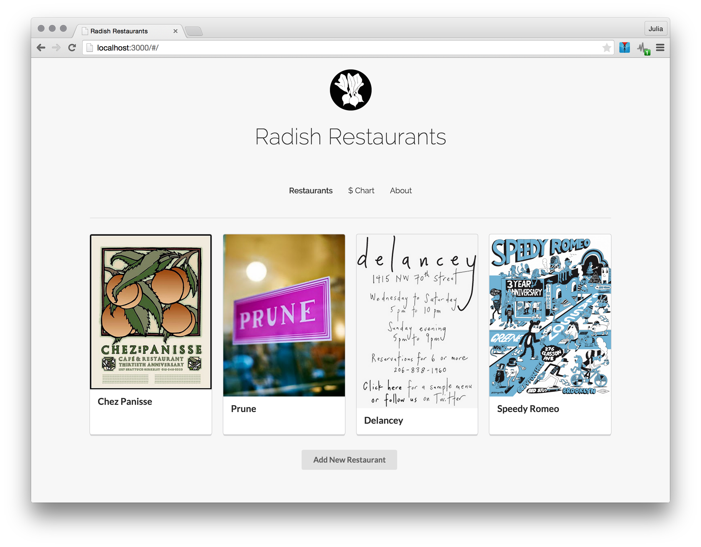
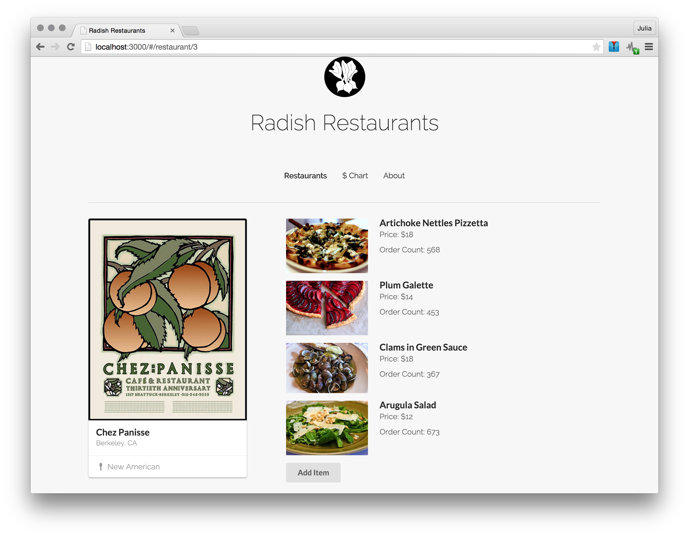
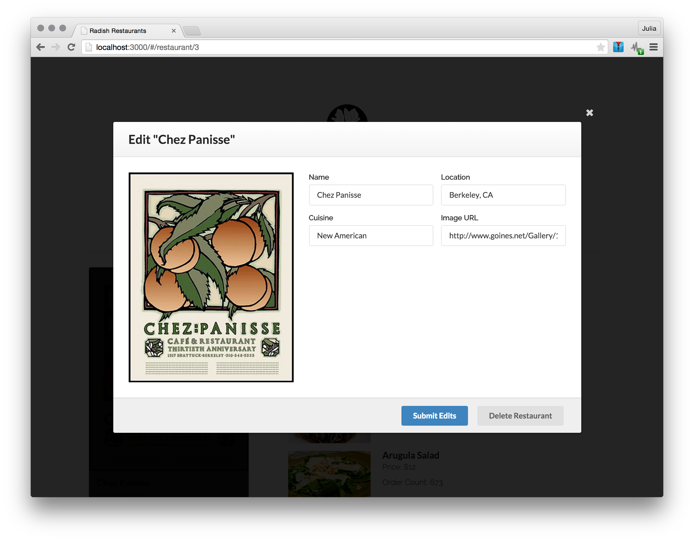
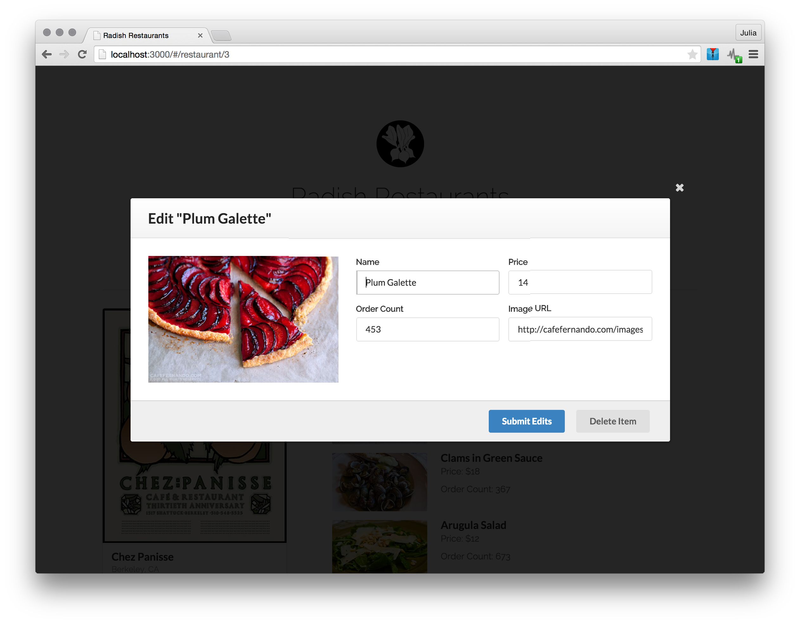
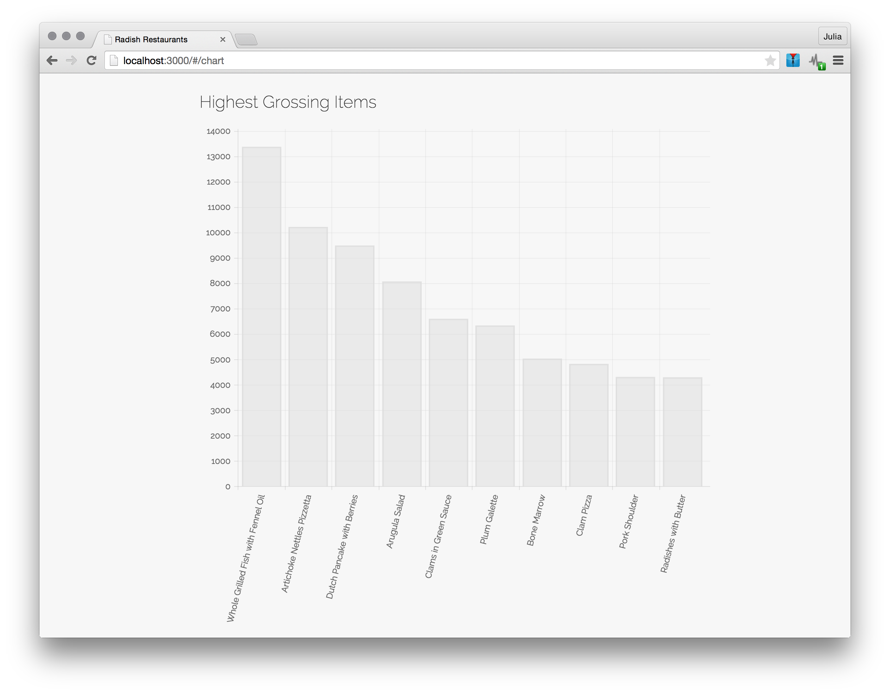
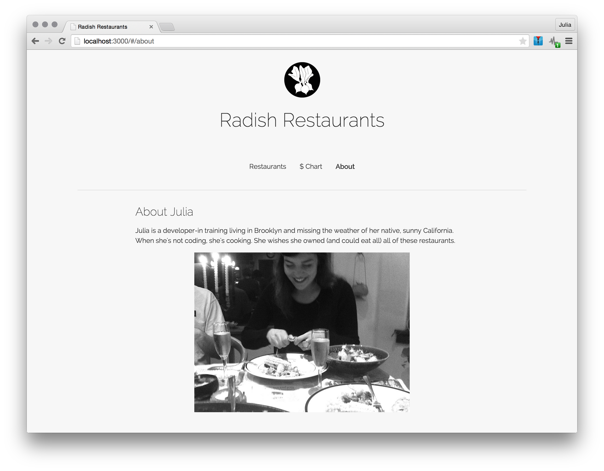
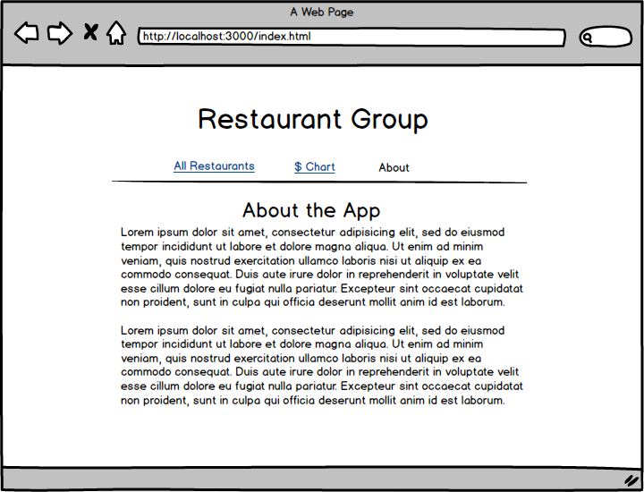

#Radish Restaurants

A one-page front-end focused web app to store restaurant and menu data.

##Features

* User can view all restaurants currently in the database.

* User can view an individual restaurant and its menu items. Menu items can be re-ordered by click & drag (order refreshed on page refresh).

* User can add, delete, and update restaurants ( details include name, location, cuisine, and image).

* User can add, delete, and update menu items for any given restaurant (details include name, price, order count, image).

* User can view the top ten highest grossing items in chart form.

* User can view an "About the Developer" page.

##Wireframes

* All Restaurants / Homepage

* Add New Restaurant

* Restaurant Detail

* About Page

##ERD

Restaurants

| id  | name | location | cuisine  | image_url
| ------------- |:-------------:| -----:|
| 1      | Chez Panisse | Berkeley, CA | New American | http://...
| 2      | Delancey      |   Seattle, WA | Italian | http://...
| 3 | Speedy Romeo      |    Brooklyn, NY | Italian | http://...

Items

| id  | name | price | order_count  | image_url | restaurant_id
| ------------- |:-------------:| -----:|
| 1      | Artichoke Pizza | 18 | 275 | http://... | 1
| 2      | Plum Galette | 12 | 452 | http://... | 2
| 3 | Pork Shoulder| 23 | 367 | http://... | 3

##Libraries, Frameworks, & Stylesheets

**jQuery** (>=1.8)

 Javascript framework used to simplify interactions with and manipulation of DOM elements.

**JSON-Server** (^.7.2)

Creates a fake RESTful API from a JSON file. Ideal for quick set-up of a server.

**Mustache** (~2.0.0)

HTML template-ing library. Renders HTML by matching key-value pairs.

**Chart.js** (~1.0.2)

Creates dynamic HTML charts using the HTML <canvas> tag and minor jQuery manipulation.

**Director.js**

Creates a router to establish client-side routes. This was used for the following views: all restaurants (home), restaurant detail, chart, about.

**Draggabilly** (1.2.0)

Library to drag & drop elements on the page. This was used to re-arrange the menu item elements.

**Semantic-UI** (~1.12.1)

Robust UI framework. This library was used to set up the grid and basic styles throughout the app. The script library was used to establish actions on the modal buttons.

**Animate.css** (3.2.6)

Stylesheet for adding sweet CSS3 animations to elements.
